### Objectives

-   Recall different aspects of reproducibility
-   Learn fundamental concepts of dynamic reporting
-   Understand which problems dynamic reporting solves

------------------------------------------------------------------------

### Example

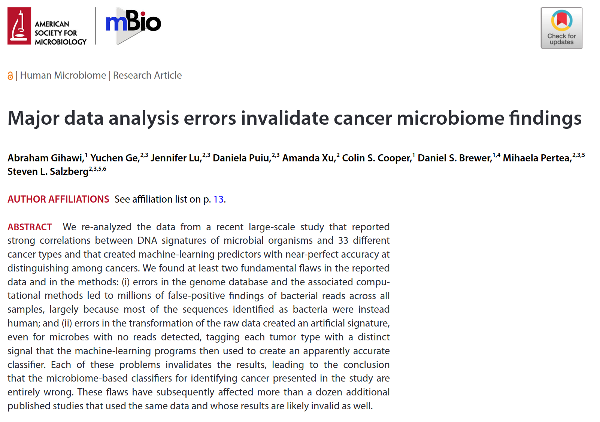{height="400"}

------------------------------------------------------------------------

### Terminology

 

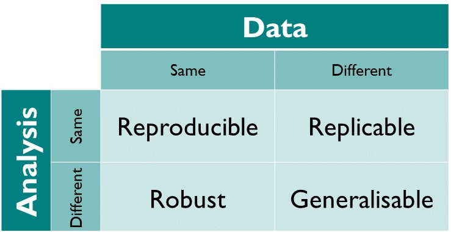{height="300"}

------------------------------------------------------------------------

### Generalizability

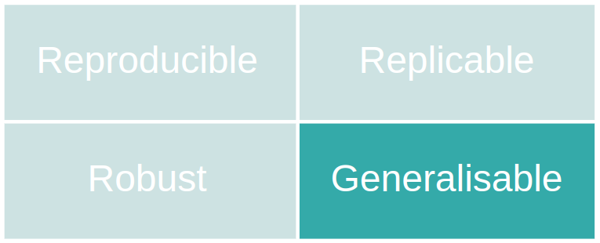{.absolute right="0" top="0" height="75"}

  Generalizeability is a multi-faceted concept, among other things referring to:

::: incremental
-   **Extrapolation**: Extending conclusions available from studies in one or more subgroups of a population to another subgroup of the population
-   **Translation**: Converting results in basic research into results that directly benefit humans
:::

------------------------------------------------------------------------

### Generalizability: Example

{.absolute right="0" top="0" height="75"}

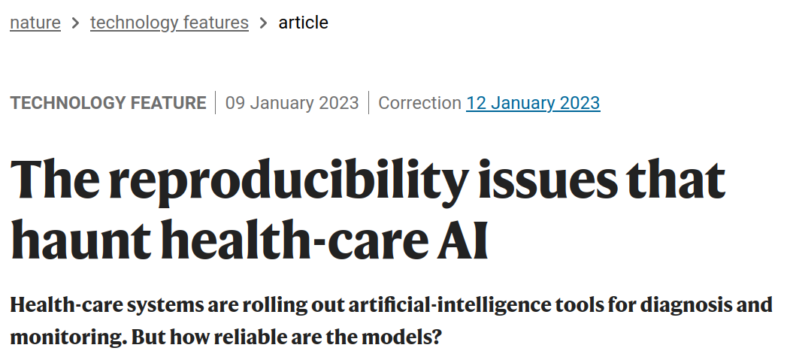{height="270"}

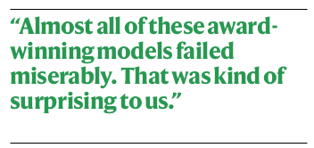{height="130"}

------------------------------------------------------------------------

### Replicability: Example

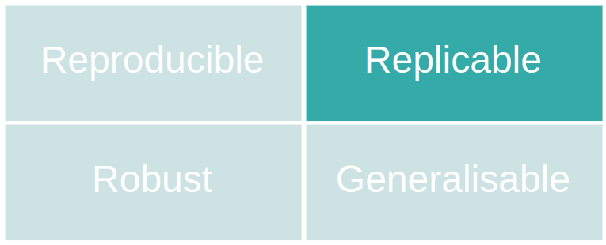{.absolute right="0" top="0" height="75"}

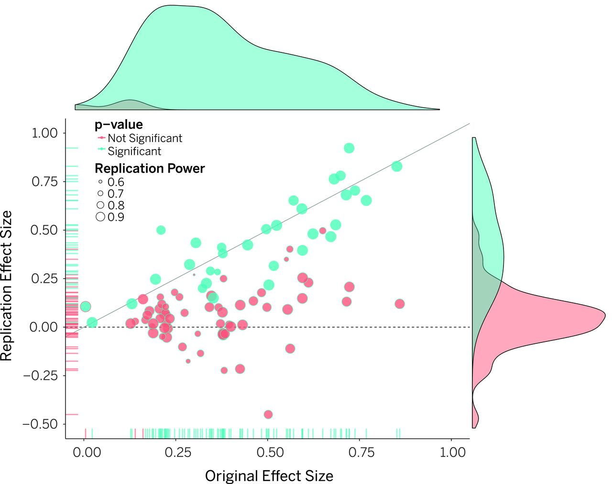{height="400"}

------------------------------------------------------------------------

### Robustness: Example

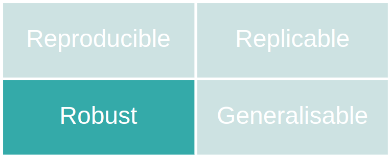{.absolute right="0" top="0" height="75"}

::::: {.columns align="center"}
::: {.column width="50%"}
{height="400"}
:::

::: {.column width="50%" align="top"}
{height="400"}
:::
:::::

------------------------------------------------------------------------

### Threats to robustness and replicability

:::::: {.columns align="center"}
:::: {.column width="50%"}
::: incremental
-   "Garden of Forking Paths"   @gelman2013
-   "Researcher Degrees of Freedom"   @simmons2011
-   "Selective reporting"   @hoffmann2021
:::
::::

::: {.column width="50%" align="top"}
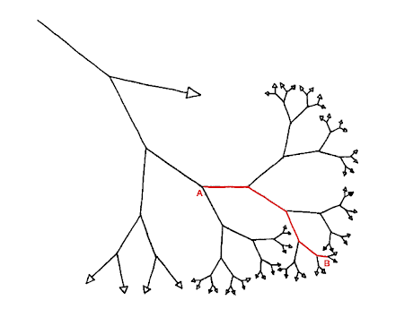{width="120%"}
:::
::::::

-----

### Reproducibility

{.absolute right="0" top="0" height="75"}

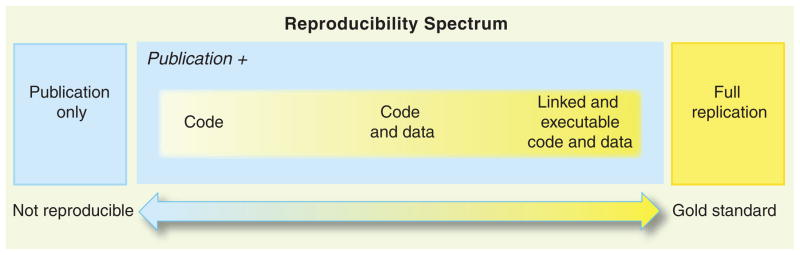{height="250"}

Additional steps:

::: incremental
-   versioning (e.g. tutorial at <https://swcarpentry.github.io/git-novice/>)
-   containerization (e.g. CRS Primer @fragagonzález2024)
-   managing dependencies with `make` (e.g. @peikert)
:::

------------------------------------------------------------------------

### Reproducibility: typical problems

:::::: {.columns align="center"}
::: {.column width="40%" align="top"}
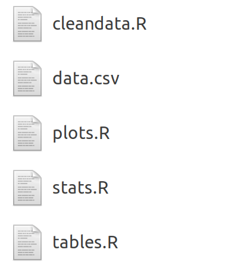{height="300"}
:::

:::: {.column .fragment width="60%"}
::: incremental
-   unclear execution order
-   probably poor documentation
-   unclear further processing of output
:::
::::
::::::

------------------------------------------------------------------------

### Dynamic reporting

:::::: {.columns align="center"}
::: {.column width="45%" align="top"}
Problems

-   unclear execution order
-   probably poor documentation
-   unclear further processing of the output
:::

:::: {.column .fragment width="55%"}
Dynamic reporting

::: incremental
-   defines order in one single file
-   simplifies documentation with a markup language
-   automates generation and processing of code output
:::
::::
::::::

------------------------------------------------------------------------

### A non-dynamic reporting workflow

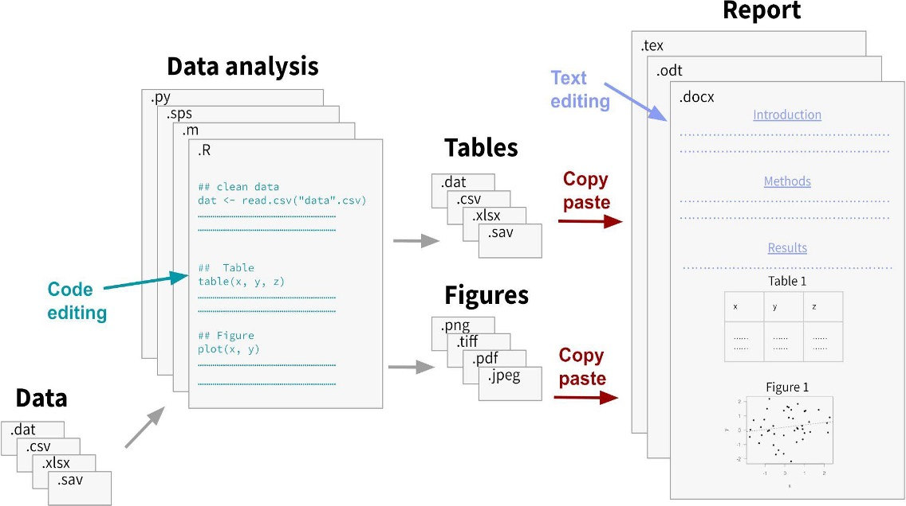{height="400"}

------------------------------------------------------------------------

### A dynamic reporting workflow

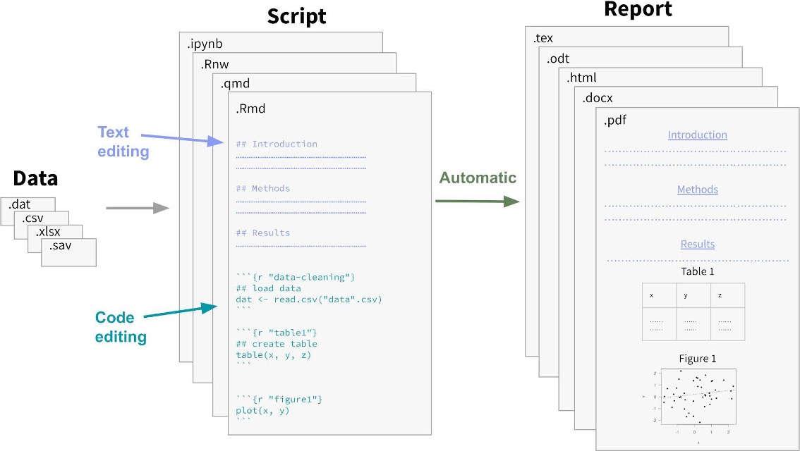{height="400"}

------------------------------------------------------------------------

### Components of a dynamic report

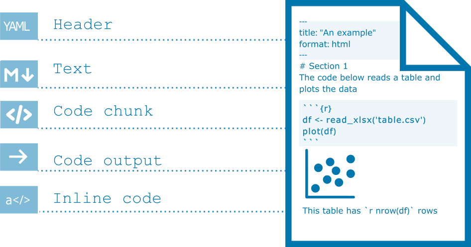{height="400"}

------------------------------------------------------------------------

### Common markup languages

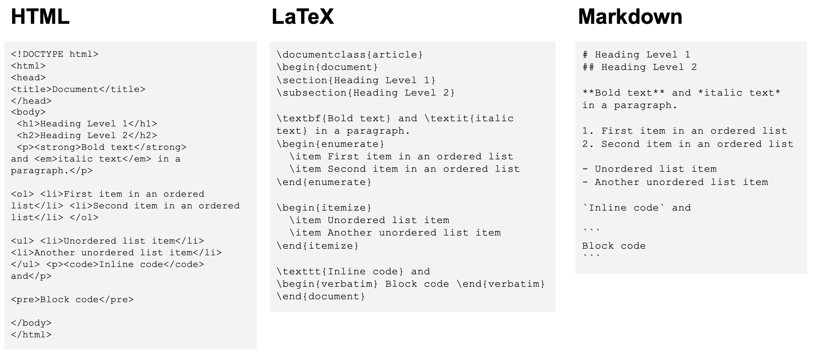{height="400"}

------------------------------------------------------------------------

### Popular implementations

 

|                  | Code             | Markup   | Output formats                  |
|-------------------|------------------|------------------|------------------|
| knitr .Rnw       | R                | LaTeX    | pdf, tex                        |
| R Markdown       | R                | Markdown | pdf, html, docx, pptx, tex      |
| Jupyter Notebook | Julia, Python, R | Markdown | pdf, html, tex, py, ...         |
| Quarto           | Julia, Python, R | Markdown | pdf, html, tex, docx, pptx, ... |

: {.striped tbl-colwidths="\[30,25,20,40\]"}

 

Yihui Xie's blog post: [With Quarto coming, is R Markdown going away? No.](https://yihui.org/en/2022/04/quarto-r-markdown/)

------------------------------------------------------------------------

### The Quarto Render action

 

{height="175"}

Source: <https://quarto.org/docs/get-started/hello/rstudio.html>

------------------------------------------------------------------------

### Limitations and Outlook

:::::: {.columns align="center"}
::: {.column width="45%" align="top"}
**Limitations**

-   adds new dependencies
-   does not guarantee computational reproducibility
-   challenges for collaborative editing of manuscripts
:::

:::: {.column .fragment width="55%"}
**Facilitators**

::: incremental
-   integrates well with other good practices for computational reproducibility
-   growing number of tools for collaborative editing of source documents
:::
::::
::::::

------------------------------------------------------------------------

### Additional Resources

-   CRS Primer on dynamic reporting: <https://doi.org/10.5281/zenodo.7565735>
-   Quarto intro tutorial: <https://quarto.org/docs/get-started/hello/rstudio.html>
-   Quarto authoring tutorial: <https://quarto.org/docs/get-started/authoring/>
-   Quarto article layout: <https://quarto.org/docs/authoring/article-layout.html>
-   R4DS chapter on Quarto: <https://r4ds.hadley.nz/quarto>
-   Reproducible manuscripts with Quarto: [Slides by Mine Cetinkaya-Rundel](https://mine.quarto.pub/manuscripts-conf23/#/title-slide)
-   Quarto/RMarkdown -- What's different?: [Slides by Ted Laderas](https://laderast.github.io/qmd_rmd/#/title-slide)

------------------------------------------------------------------------

### The Center for Reproducible Science

::::: {.columns align="center"}
::: {.column width="50%"}
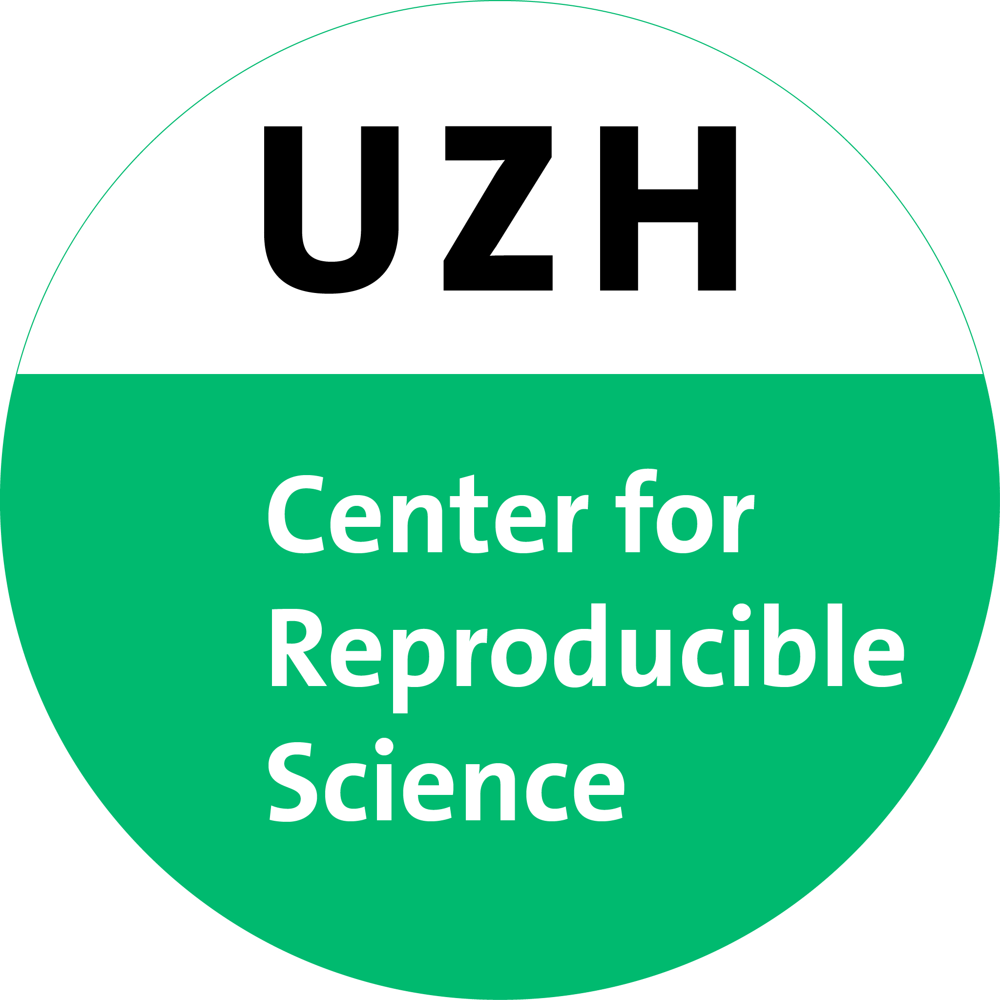{height="175"}
:::

::: {.column width="50%" align="top"}
**Teaching and training**:

-   Good Research Practice courses
-   [Primers](https://www.crs.uzh.ch/en/resources/CRS-Primers.html) and [Reproducibility Notes](https://www.crs.uzh.ch/en/resources/CRS-Reproducibility-Notes.html)
-   [ReproducibiliTea](https://www.crs.uzh.ch/en/training/ReproducibiliTea.html) journal club

**Research**:

-   Design and analysis of replication studies
-   Meta-research
:::
:::::

------------------------------------------------------------------------

### The Swiss Reproducibility Network

::::: {.columns align="center"}
::: {.column width="50%"}
{height="175"}

Working groups:

-   Computational Reproducibility
-   Open Research Data
-   Preregistration and Registered Reports
-   Training
-   Research Assessment and Incentives
:::

::: {.column width="50%" align="top"}
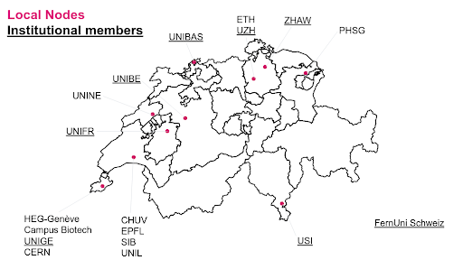{height="250"}
:::
:::::

------------------------------------------------------------------------

### References {.smaller}
